# Attendance System - Online/Offline Architecture

Dokumen ini menjelaskan alur kerja dan arsitektur sistem untuk kondisi Online dan Offline pada ketiga platform: **Mobile App**, **Kiosk**, dan **Admin Dashboard**.

---

## 📊 Overview Arsitektur

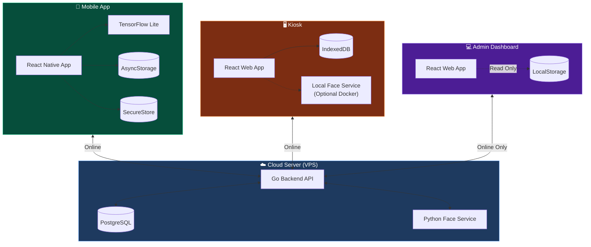

---

## 1️⃣ Mobile App

### Kapabilitas Offline

| Fitur | Online | Offline |
|-------|--------|---------|
| **Login** | ✅ Server Auth | ✅ Cached Credentials |
| **Check-In/Out** | ✅ API Server | ✅ Queue Lokal |
| **Face Verification** | ✅ TFLite Lokal | ✅ TFLite Lokal |
| **View Riwayat** | ✅ API Server | ⚠️ Data Cached |
| **Sync Data** | - | ✅ Auto saat online |

> [!IMPORTANT]
> **Offline Login Requirements:**
> - User harus pernah login online minimal 1x
> - Credentials valid selama **7 hari** tanpa login online
> - Password di-hash dengan **SHA-256 + salt**
> - Disimpan di **Secure Store** (Keychain iOS / Keystore Android)

### Flow Diagram - Mobile Login (Online vs Offline)

```mermaid
flowchart TD
    Start([Buka App]) --> CheckNet{Cek Koneksi}
    
    CheckNet -->|Online| OnlineLogin
    CheckNet -->|Offline| OfflineLogin
    
    subgraph OnlineLogin["🌐 ONLINE LOGIN"]
        OL1[User input Email + Password] --> OL2["POST /api/auth/login"]
        OL2 --> OL3{Response?}
        OL3 -->|Success| OL4[Return JWT + User Data]
        OL4 --> OL5[Cache Credentials ke SecureStore]
        OL5 --> OL6[Cache User Data ke AsyncStorage]
        OL6 --> OL7[/"✅ Login Berhasil"/]
        OL3 -->|Failed| OL8[/"❌ Login Gagal"/]
    end
    
    subgraph OfflineLogin["📴 OFFLINE LOGIN"]
        OFF1[User input Email + Password] --> OFF2{Cached Credentials\nTersedia?}
        OFF2 -->|Ya| OFF3[Hash Input Password]
        OFF3 --> OFF4{Hash Match?}
        OFF4 -->|Ya| OFF5{Valid < 7 Hari?}
        OFF5 -->|Ya| OFF6[Load User dari Cache]
        OFF6 --> OFF7[/"✅ Login Berhasil\n(Mode Offline)"/]
        OFF5 -->|Tidak| OFF8[/"❌ Credentials Expired"/]
        OFF4 -->|Tidak| OFF9[/"❌ Password Salah"/]
        OFF2 -->|Tidak| OFF10[/"❌ Belum Pernah Login"/]
    end
    
    style OnlineLogin fill:#064e3b,stroke:#34d399
    style OfflineLogin fill:#78350f,stroke:#fbbf24
```

### Flow Diagram - Mobile Check-In

```mermaid
flowchart TD
    Start([User buka Check-In]) --> CheckLoc{Cek Lokasi GPS}
    CheckLoc -->|Valid| CheckNet{Cek Koneksi}
    CheckLoc -->|Invalid| ErrLoc[/"❌ Di luar radius"/]
    
    CheckNet -->|Online| OnlineFlow
    CheckNet -->|Offline| OfflineFlow
    
    subgraph OnlineFlow["🌐 ONLINE MODE"]
        OF1[Buka Kamera] --> OF2[TFLite: Extract Embedding]
        OF2 --> OF3[Bandingkan dengan Cache]
        OF3 -->|Match| OF4["POST /api/attendance/check-in"]
        OF4 --> OF5[/"✅ Check-In Berhasil"/]
        OF3 -->|No Match| OF6[/"❌ Wajah tidak cocok"/]
    end
    
    subgraph OfflineFlow["📴 OFFLINE MODE"]
        OFF1[Buka Kamera] --> OFF2[TFLite: Extract Embedding]
        OFF2 --> OFF3[Bandingkan dengan Cache\ndi AsyncStorage]
        OFF3 -->|Match| OFF4[Simpan ke\nOffline Queue]
        OFF4 --> OFF5[/"✅ Check-In Tersimpan\n(Offline)"/]
        OFF3 -->|No Match| OFF6[/"❌ Wajah tidak cocok"/]
    end
    
    OFF5 --> SyncLater[/"⏳ Sync saat online"/]
    
    style OnlineFlow fill:#064e3b,stroke:#34d399
    style OfflineFlow fill:#78350f,stroke:#fbbf24
```

### Data Storage - Mobile

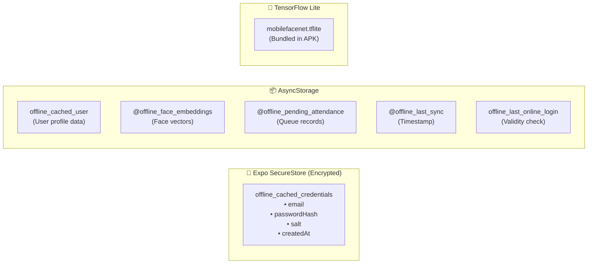

### Sync Flow - Mobile

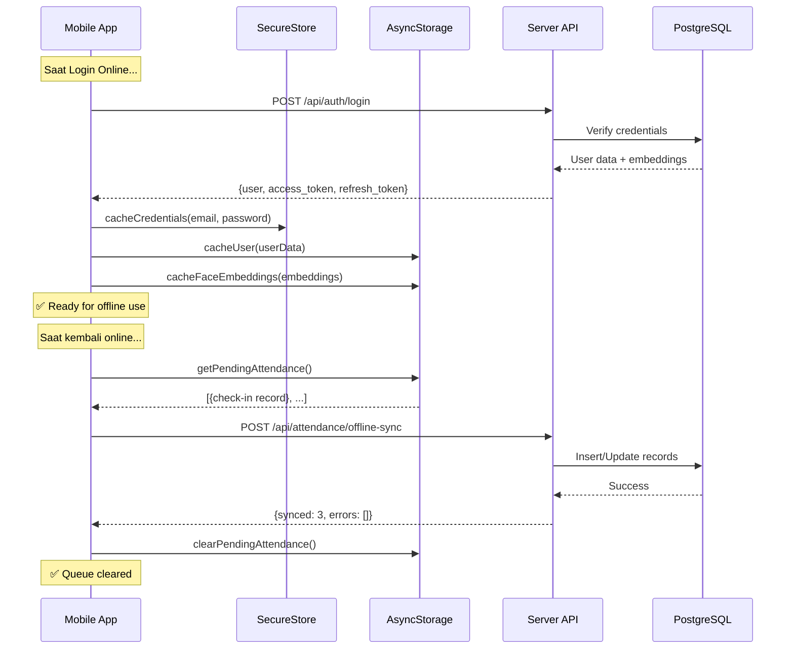

---

## 2️⃣ Kiosk

### Kapabilitas Offline

| Fitur | Online | Offline |
|-------|--------|---------|
| **Scan QR** | ✅ Server Lookup | ✅ IndexedDB Lookup |
| **Check-In/Out** | ✅ API Server | ✅ Queue Lokal |
| **Face Verification** | ✅ Server/Local | ⚠️ Simplified |
| **Registrasi Wajah** | ✅ API Server | ❌ Tidak bisa |
| **Sync Data** | ✅ Auto 30 menit | - |

> [!NOTE]
> Kiosk tidak memerlukan login karena sudah di-pair dengan admin code.

### Flow Diagram - Kiosk Check-In

```mermaid
flowchart TD
    Start([QR Code Scan]) --> CheckNet{Cek Koneksi}
    
    CheckNet -->|Online| OnlineFlow
    CheckNet -->|Offline| OfflineFlow
    
    subgraph OnlineFlow["🌐 ONLINE MODE"]
        ON1["POST /api/kiosk/scan"] --> ON2{Employee Found?}
        ON2 -->|Yes| ON3[Tampilkan Info Karyawan]
        ON2 -->|No| ON4[/"❌ Tidak ditemukan"/]
        ON3 --> ON5[Capture Foto]
        ON5 --> ON6["POST /api/kiosk/check-in"]
        ON6 --> ON7[/"✅ Check-In Berhasil"/]
    end
    
    subgraph OfflineFlow["📴 OFFLINE MODE"]
        OFF1[Lookup di IndexedDB] --> OFF2{Employee Found?}
        OFF2 -->|Yes| OFF3[Tampilkan Info Karyawan]
        OFF2 -->|No| OFF4[/"❌ Tidak ditemukan (offline)"/]
        OFF3 --> OFF5[Capture Foto]
        OFF5 --> OFF6[Simpan ke\nIndexedDB Queue]
        OFF6 --> OFF7[/"✅ Check-In Tersimpan\n(Offline)"/]
    end
    
    OFF7 --> Sync[/"⏳ Auto-sync saat online"/]
    
    style OnlineFlow fill:#1e3a5f,stroke:#60a5fa
    style OfflineFlow fill:#78350f,stroke:#fbbf24
```

### Data Storage - Kiosk

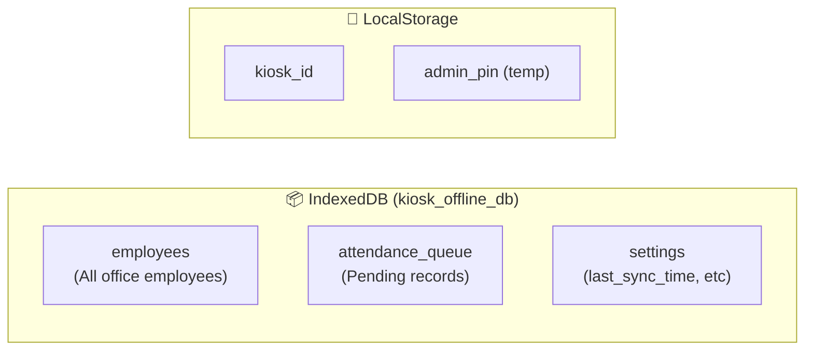

### Sync Flow - Kiosk

```mermaid
sequenceDiagram
    participant Kiosk as Kiosk Web
    participant IDB as IndexedDB
    participant API as Server API
    participant DB as PostgreSQL
    
    Note over Kiosk: Setiap 30 menit (atau saat online)...
    
    rect rgb(30, 58, 95)
        Note over Kiosk,API: 1. Download Employee Data
        Kiosk->>API: GET /api/kiosk/sync-data?kiosk_id=xxx
        API->>DB: SELECT employees WHERE office_id = ...
        DB-->>API: [Employee data + embeddings]
        API-->>Kiosk: {employees: [...], last_sync_time: ...}
        Kiosk->>IDB: cacheEmployees(employees)
    end
    
    rect rgb(120, 53, 15)
        Note over Kiosk,API: 2. Upload Pending Attendance
        Kiosk->>IDB: getPendingAttendance()
        IDB-->>Kiosk: [{record1}, {record2}, ...]
        Kiosk->>API: POST /api/kiosk/offline-sync
        API->>DB: INSERT attendance records
        DB-->>API: Success
        API-->>Kiosk: {synced: 5, errors: []}
        Kiosk->>IDB: clearSyncedAttendance()
    end
```

---

## 3️⃣ Admin Dashboard

### Kapabilitas Offline

| Fitur | Online | Offline |
|-------|--------|---------|
| **Login** | ✅ Server Auth | ❌ Tidak bisa |
| **View Dashboard** | ✅ Real-time | ❌ Tidak bisa |
| **Manage Users** | ✅ CRUD | ❌ Tidak bisa |
| **View Reports** | ✅ Query DB | ❌ Tidak bisa |
| **Settings** | ✅ API Server | ❌ Tidak bisa |

> [!WARNING]
> **Admin Dashboard tidak memiliki mode offline** karena semua operasi memerlukan data real-time dari server dan memiliki implikasi keamanan yang tinggi.

### Flow Diagram - Admin Dashboard

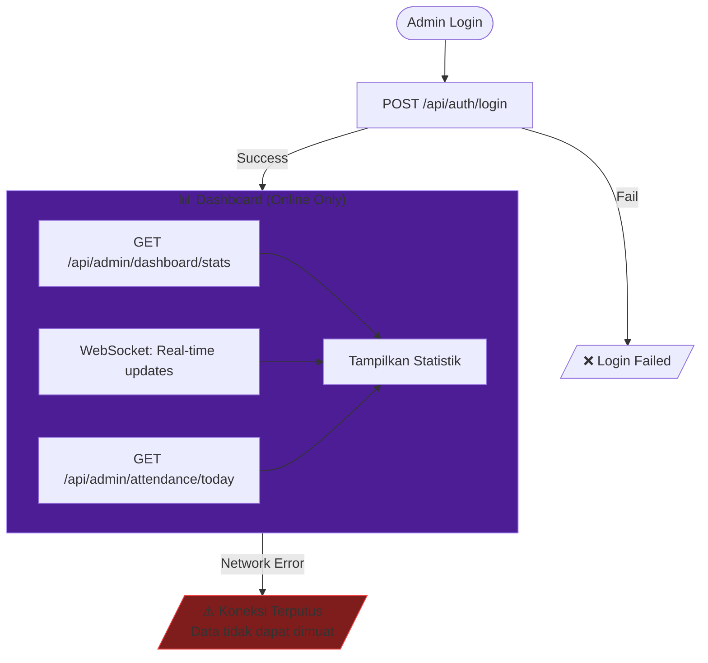

---

## 📱 Perbandingan Platform

| Fitur | 📱 Mobile | 🖥️ Kiosk | 💻 Admin |
|-------|----------|---------|---------|
| **Offline Login** | ✅ Ya (7 hari) | N/A (pairing) | ❌ Tidak |
| **Offline Check-In** | ✅ Ya | ✅ Ya | ❌ Tidak |
| **Face Verify Offline** | ✅ TFLite | ⚠️ Simplified | ❌ Tidak |
| **Data Sync** | ✅ Auto | ✅ 30 menit | ❌ Tidak |
| **Credential Storage** | SecureStore | - | - |
| **Data Storage** | AsyncStorage | IndexedDB | LocalStorage |

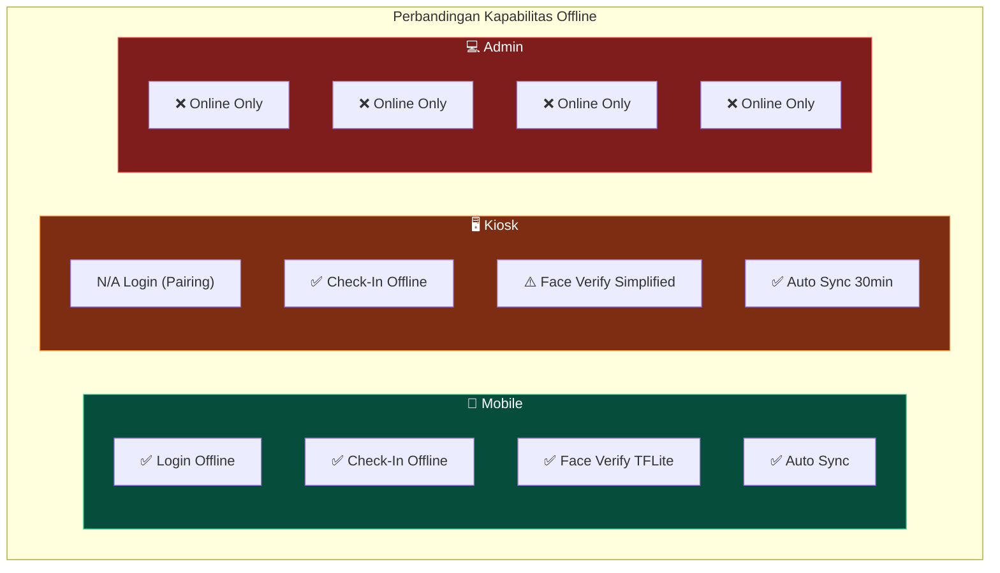

---

## 🔄 Data Flow Summary

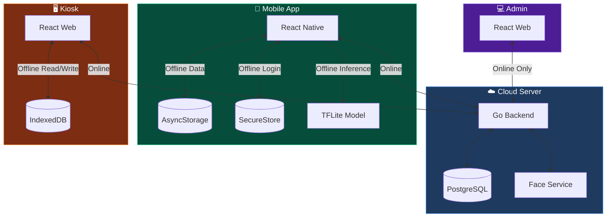

---

## 📋 Checklist Prasyarat Offline

### Mobile App
- [x] User harus login online minimal 1x (untuk cache credentials & embeddings)
- [x] Face embeddings tersimpan di AsyncStorage
- [x] Credentials tersimpan di SecureStore (encrypted)
- [x] TFLite model bundled dalam APK
- [x] GPS berfungsi tanpa internet
- [x] Offline login valid 7 hari

### Kiosk
- [x] Kiosk sudah di-pair dengan office
- [x] Sync data employee minimal 1x
- [x] IndexedDB tersedia di browser
- [ ] (Optional) Local Face Service running

### Admin Dashboard
- [ ] Tidak ada mode offline
- [ ] Semua operasi memerlukan koneksi internet

---

## 🔐 Security Considerations

### Mobile Offline Login

| Aspek | Implementasi |
|-------|--------------|
| **Password Storage** | SHA-256 hash dengan random salt |
| **Token Security** | Tidak ada JWT di offline mode |
| **Validity Period** | Maksimal 7 hari tanpa online |
| **Storage Location** | Expo SecureStore (OS-level encryption) |
| **Logout Behavior** | Clear semua cached credentials |

### Kiosk Offline Mode

| Aspek | Implementasi |
|-------|--------------|
| **Admin Code** | Required untuk sync data |
| **Data Scope** | Hanya employee dari 1 office |
| **Face Data** | Disimpan di IndexedDB (browser) |
| **Sync Security** | Admin code verified per request |

---

## 🚨 Error Handling

| Skenario | Mobile | Kiosk | Admin |
|----------|--------|-------|-------|
| Network timeout | Fallback offline login | Fallback offline | Show error |
| Server 500 | Retry + queue | Retry + queue | Show error |
| No cached data | Cannot check-in | Cannot check-in | N/A |
| Expired credentials | Prompt online login | N/A | N/A |
| Corrupted cache | Clear + re-login | Clear + re-sync | N/A |
| Sync conflict | Server data wins | Server data wins | N/A |
